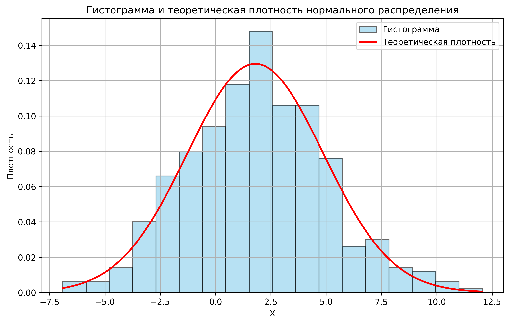
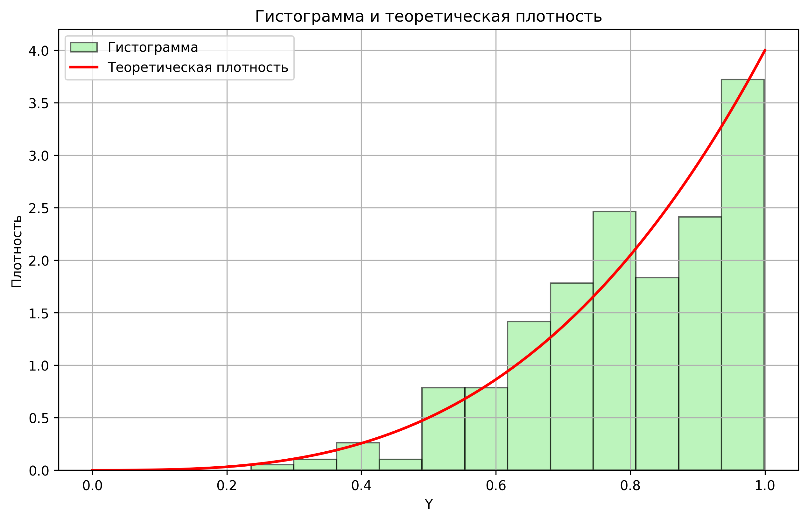

# Отчет по индивидуальному заданию
## Моделирование и статистический анализ случайных данных

---

## Раздел 1: Нормальное распределение

**Исходные данные:**  
n = 475, μ = 1.8, σ² = 9.5, γ = 0.999, α = 0.001

### 1.1 Гистограмма и теоретическая плотность
Формула плотности нормального распределения:

$$f(x) = \frac{1}{\sqrt{2\pi\sigma^2}} \exp\left( -\frac{(x - \mu)^2}{2\sigma^2} \right)$$

### 1.2 Выборочные характеристики
- Среднее: 
$$\bar{x} = \frac{1}{n} \sum x_i = 1.8797$$  
- Смещённая дисперсия: 
$$
\hat{\sigma}^2 = \frac{1}{n} \sum (x_i - \bar{x})^2 = 9.7881
$$  
- Несмещённая дисперсия: 
$$
s^2 = \frac{1}{n-1} \sum (x_i - \bar{x})^2 = 9.8087
$$

### 1.3 Метод максимального правдоподобия (ММП)
- ММП-оценка для математического ожидания:
$$
\hat{\mu} = \bar{x} = 1.8797
$$
- ММП-оценка дисперсии:
$$
\hat{\sigma}^2 = \frac{1}{n} \sum (x_i - \hat{\mu})^2 = 9.7881
$$

### 1.4 Доверительные интервалы
- Для среднего (σ известна):
$$
\left[ 
\bar{x} - z_{\alpha/2} \frac{\sigma}{\sqrt{n}}, 
\bar{x} + z_{\alpha/2} \frac{\sigma}{\sqrt{n}} 
\right] = [1.4144, 2.3451]
$$

- Для дисперсии (σ неизвестна):
$$
\left[ 
\frac{(n-1)s^2}{\chi^2_{1-\alpha/2}(n-1)}, 
\frac{(n-1)s^2}{\chi^2_{\alpha/2}(n-1)} 
\right] = [7.9898, 12.2613]
$$

### 1.5 Проверка гипотезы (критерий Пирсона)
- Статистика:
$$
\chi^2 = \sum_{i=1}^k \frac{(n_i - np_i)^2}{np_i} = 24.2867
$$
- Критическое значение: 42.3124  
**Вывод:** гипотеза о нормальности принимается.

---

## Раздел 2: Степенное распределение

**Исходные данные:**  
a = 4, n = 300, γ = 0.92, α = 0.05

### 2.1 Гистограмма и плотность
Формула плотности степенного распределения:

$$
f(y) = a \cdot y^{a - 1}, \quad y \in [0, 1]
$$

### 2.2 Точечные оценки
- Теоретическое среднее: 
$$
\mathbb{E}[Y] = \frac{a}{a+1}
$$
- Выборочное среднее: 0.7977  
- Выборочная дисперсия: 0.0239

### 2.3 Метод моментов
- Оценка параметра через метод моментов:
$$
\hat{a} = \frac{\bar{y}}{1 - \bar{y}} = 3.9434
$$

### 2.4 Доверительные интервалы
- Для среднего:
$$
\left[ 
\bar{y} - z_{\alpha/2} \sqrt{\frac{s^2}{n}}, 
\bar{y} + z_{\alpha/2} \sqrt{\frac{s^2}{n}} 
\right] = [0.7802, 0.8152]
$$

- Для дисперсии:
$$
\left[ 
\frac{(n-1)s^2}{\chi^2_{1-\alpha/2}(n-1)}, 
\frac{(n-1)s^2}{\chi^2_{\alpha/2}(n-1)} 
\right] = [0.0204, 0.0282]
$$

### 2.5 Проверка гипотезы
- Статистика χ²: 26.3405  
- Критическое значение: 24.9958  
**Вывод:** гипотеза отвергается.

---

## Раздел 3: Двумерное нормальное распределение

**Исходные данные:**  
μX = 1.8, σ²X = 9.5, μY = -4.5, σ²Y = 3.61, ρ = -0.18, n = 475, α = 0.05

### 3.1 Точечные оценки
- M[X] = 1.7169, D[X] = 10.2108  
- M[Y] = -4.4513, D[Y] = 3.3984  
- Выборочная корреляция: 
$$
r(X,Y) = -0.1614
$$

### 3.2 Проверка гипотезы независимости
- Критерий χ² Пирсона:
$$
\chi^2 = \sum_{i,j} \frac{(O_{ij} - E_{ij})^2}{E_{ij}} = 367.6418
$$
- Критерий Стьюдента для корреляции:
$$
t = r\sqrt{\frac{n-2}{1-r^2}} = -3.5563
$$
- Критическое t-значение: ±1.9650  
**Вывод:** корреляция значима.

### 3.3 Анализ влияния корреляции
(Таблица и визуализации без изменений)

---

## Заключение

- При увеличении объема выборки точность оценок возрастает.
- Ширина доверительного интервала растёт с увеличением доверительной вероятности.
- Малое значение α повышает вероятность принятия гипотезы.
- Даже при точной генерации возможно отклонение гипотезы.

---

- **Среднее:**
$$
\bar{x} = \frac{1}{n} \sum_{i=1}^n x_i
$$

- **Смещённая дисперсия:**
$$
\hat{\sigma}^2 = \frac{1}{n} \sum_{i=1}^n (x_i - \bar{x})^2
$$

- **Несмещённая дисперсия:**
$$
s^2 = \frac{1}{n-1} \sum_{i=1}^n (x_i - \bar{x})^2
$$

- **Метод моментов для степенного распределения:**
$$
\hat{a} = \frac{\bar{y}}{1 - \bar{y}}
$$

- **ММП-оценки (нормальное распределение):**
$$
\hat{\mu} = \bar{x}, \quad \hat{\sigma}^2 = \frac{1}{n} \sum_{i=1}^n (x_i - \bar{x})^2
$$

- **Доверительный интервал для среднего (σ известна):**
$$
\left[ \bar{x} - z_{\alpha/2} \cdot \frac{\sigma}{\sqrt{n}}, \ \bar{x} + z_{\alpha/2} \cdot \frac{\sigma}{\sqrt{n}} \right]
$$

- **Доверительный интервал для дисперсии:**
$$
\left[ \frac{(n-1)s^2}{\chi^2_{1-\alpha/2}(n-1)}, \ \frac{(n-1)s^2}{\chi^2_{\alpha/2}(n-1)} \right]
$$

- **Критерий Пирсона (χ²-тест):**
$$
\chi^2 = \sum_{i=1}^k \frac{(n_i - np_i)^2}{np_i}
$$

- **Статистика значимости корреляции:**
$$
t = r \cdot \sqrt{\frac{n-2}{1 - r^2}}
$$